<picture>
  <source media="(prefers-color-scheme: dark)" srcset="assets/hero-dark.svg">
  
</picture>

  <!-- Replace YOUR-PORTFOLIO-URL once the site is live on CloudFront -->
  
  
  
  
  
  

 

<picture>
  <source media="(prefers-color-scheme: dark)" srcset="assets/terminal-dark.svg">
  
</picture>

## The stack, layer by layer

<picture>
  <source media="(prefers-color-scheme: dark)" srcset="assets/stack-dark.svg">
  
</picture>

## Flagship build

<a href="https://github.com/Harkanni/project-bedrock-0324">
  <picture>
    <source media="(prefers-color-scheme: dark)" srcset="assets/bedrock-dark.svg">
    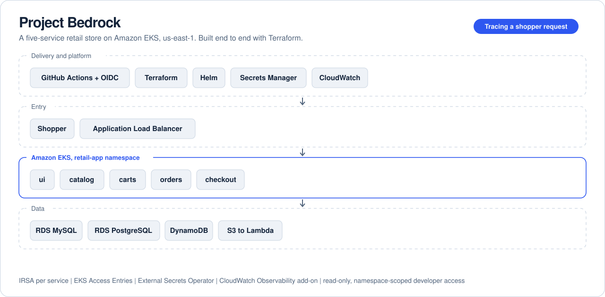
  </picture>
</a>

## More builds

  <picture><source media="(prefers-color-scheme: dark)" srcset="assets/starttech-dark.svg">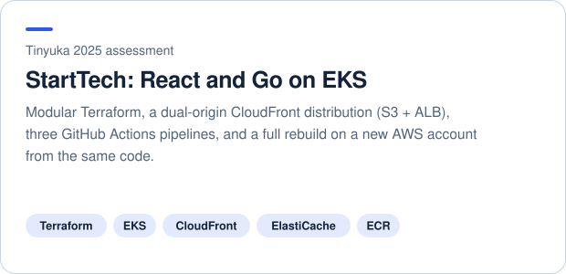</picture>
  <picture><source media="(prefers-color-scheme: dark)" srcset="assets/huddle-dark.svg">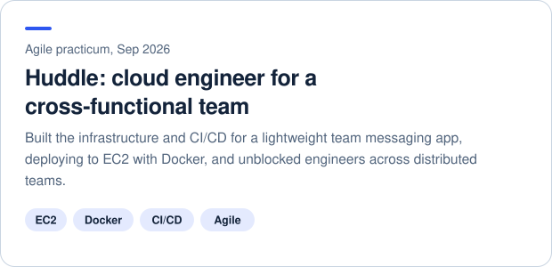</picture>
  <a href="https://github.com/Harkanni/3-tier-architecture"><picture><source media="(prefers-color-scheme: dark)" srcset="assets/threetier-dark.svg">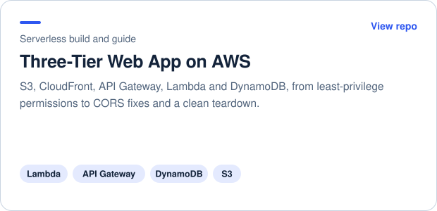</picture></a>
  <a href="https://github.com/Harkanni/status-chunks"><picture><source media="(prefers-color-scheme: dark)" srcset="assets/status-dark.svg">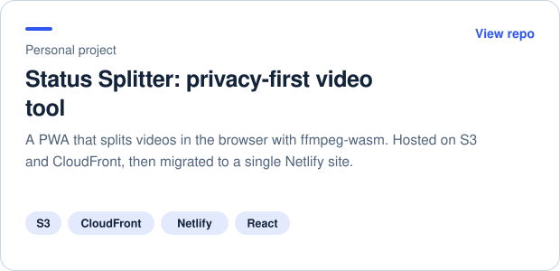</picture></a>
  <picture><source media="(prefers-color-scheme: dark)" srcset="assets/muchtodo-dark.svg">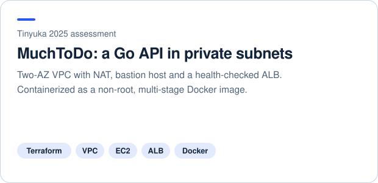</picture>
  <picture><source media="(prefers-color-scheme: dark)" srcset="assets/odoo-dark.svg">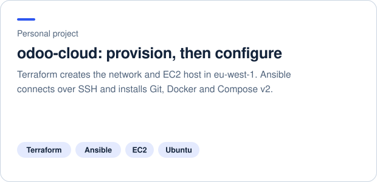</picture>

## Incident log

Most of what I know came from things breaking. Open one.

<b>🔴 EKS nodes never joined the cluster</b> &nbsp;·&nbsp; <code>NodeCreationFailure</code>

> **Cause:** node subnets had no route table association and public IP assignment was off, so nodes couldn't reach the control plane. 
> **Fix:** corrected subnet routing and IP settings in Terraform. 
> **Lesson:** a Kubernetes failure can start at the VPC layer.

<b>🔴 Every CI run said resources "already exist"</b> &nbsp;·&nbsp; Terraform state

> **Cause:** no remote backend, so each runner started from empty state and parallel runs left orphaned resources. 
> **Fix:** S3 remote state with locking, plus an idempotent Bash cleanup script.

<b>🔴 Pods couldn't reach instance metadata</b> &nbsp;·&nbsp; EKS networking

> **Cause:** the IMDSv2 hop limit of 1 drops responses that need an extra hop into a container. 
> **Fix:** a custom EKS launch template that raises the hop limit.

<b>🔴 Logged-in users got a 401 on every request</b> &nbsp;·&nbsp; Go backend behind HTTPS

> **Cause:** Viper wasn't binding environment variables, so cookie domain and secure flags never applied in production. 
> **Fix:** explicit <code>BindEnv()</code> calls and correct <code>COOKIE_DOMAINS</code> and <code>SECURE_COOKIE</code> values.

<b>🔴 <code>terraform destroy</code> got stuck halfway</b> &nbsp;·&nbsp; teardown

> **Cause:** External Secrets CRDs were removed before the objects that depended on them. 
> **Fix:** disabled the dependent config, cleaned stale state, emptied the bucket, finished a clean destroy.

## Writing

  <a href="https://medium.com/@cloudopstechlead/build-a-three-tier-web-app-8762da58ea7a"><picture><source media="(prefers-color-scheme: dark)" srcset="assets/post-threetier-dark.svg">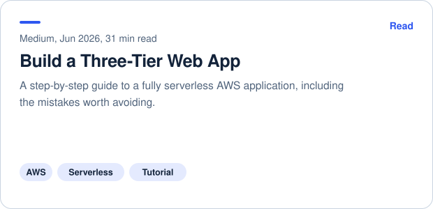</picture></a>
  <a href="https://medium.com/@cloudopstechlead/i-had-an-engineering-interview-the-other-day-with-a-big-tech-ai-company-for-a-docker-engineering-e41a671cd9c7"><picture><source media="(prefers-color-scheme: dark)" srcset="assets/post-docker-dark.svg">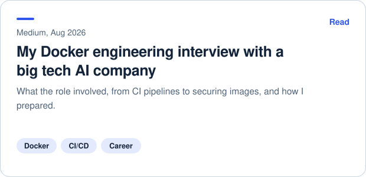</picture></a>

<b>GitHub stats</b>

 

  
  

