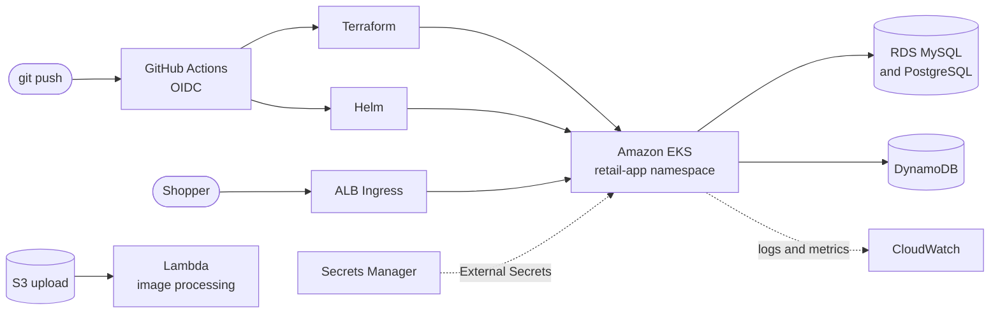

<p align="center">
  
</p>

<p align="center">
  
</p>

<p align="center">
  <!-- Replace YOUR-PORTFOLIO-URL once the site is live on CloudFront -->
  <a href="https://YOUR-PORTFOLIO-URL"></a>
  <a href="https://www.linkedin.com/in/akanniemmanuel/"></a>
  <a href="https://medium.com/@cloudopstechlead"></a>
  <a href="https://x.com/the_tech_lead"></a>
  <a href="mailto:akanniemmanuel2001@gmail.com"></a>
</p>

<p align="center">
  
  <a href="https://www.credly.com/badges/e5ab176b-0334-428c-955b-ead8ee56cdd8/public_url"></a>
  
</p>

---

### `$ terraform output akanni`

```hcl
module "akanni" {
  source   = "github.com/harkanni"
  role     = "Cloud & DevOps Engineer"
  location = "Lagos, Nigeria (open to remote)"

  focus = ["AWS", "Terraform", "Kubernetes (EKS)", "CI/CD", "Docker"]

  background = "5+ years building web apps, so I design infrastructure around what the application needs"

  currently = {
    studying = "Cloud Engineering at AltSchool Africa"
    preparing_for = "AWS Certified Solutions Architect – Associate"
    writing  = "medium.com/@cloudopstechlead"
  }

  fun_fact = "2600-rated chess player (I wish...)"
}
```

---

### 🛠️ Stack

<p align="left">
  
  <br />
  
</p>

| Layer | What I use |
|---|---|
| **Cloud** | EC2, EKS, VPC, IAM, S3, CloudFront, ALB, Lambda, RDS, DynamoDB, ElastiCache, ECR, Secrets Manager, CloudWatch |
| **Infrastructure as code** | Terraform modules, S3 remote state with locking, Ansible |
| **Containers** | Docker multi-stage builds, Docker Compose, Kubernetes, Helm, AWS Load Balancer Controller |
| **Delivery** | GitHub Actions, OIDC federation, multi-target deploys (S3 + CloudFront, Netlify, Render) |
| **Security** | Least-privilege IAM, IRSA, EKS Access Entries, namespace RBAC, External Secrets Operator |

---

### 🏗️ Featured work

#### [Project Bedrock](https://github.com/Harkanni/project-bedrock-0324): a microservices store on Amazon EKS

A five-service retail app on a production-grade EKS cluster, provisioned end to end with Terraform.



Multi-AZ VPC · EKS 1.33 with Access Entries · per-service IRSA · External Secrets · CloudWatch Observability · S3-triggered Lambda · read-only, namespace-scoped developer access

<br />

| Project | What it shows |
|---|---|
| **StartTech** | React and Go on EKS behind a dual-origin CloudFront distribution (S3 + ALB), modular Terraform, three separate GitHub Actions pipelines, and a full rebuild on a new AWS account from the same code |
| **MuchToDo** | Go API in private subnets across two AZs with NAT, bastion host and a health-checked ALB, containerized as a non-root multi-stage image |
| **Huddle** | Cloud engineer for a cross-functional Agile team building a lightweight team messaging app, deploying to EC2 with Docker |
| **[Three-Tier Web App](https://github.com/Harkanni/3-tier-architecture)** | Serverless app on S3, CloudFront, API Gateway, Lambda and DynamoDB, written up as a [step-by-step guide](https://medium.com/@cloudopstechlead/build-a-three-tier-web-app-8762da58ea7a) |
| **[Status Splitter](https://github.com/Harkanni/status-chunks)** | Privacy-first video splitter PWA (ffmpeg-wasm), hosted on S3 + CloudFront, later migrated to Netlify |
| **odoo-cloud** | Terraform provisions the EC2 host, Ansible configures it over SSH |

---

### 🔥 Things I've broken and fixed

<details>
<summary><b>EKS nodes never joined the cluster</b> (<code>NodeCreationFailure</code>)</summary>
<br />
Subnets had no route table association and public IP assignment was off, so nodes couldn't reach the control plane. Fixed the subnet routing in Terraform.
</details>

<details>
<summary><b>Every CI run said resources "already exist"</b></summary>
<br />
No remote state backend, so each runner started from empty state. Moved state to S3 with locking and wrote an idempotent cleanup script for orphaned resources.
</details>

<details>
<summary><b>Pods couldn't reach instance metadata</b></summary>
<br />
The IMDSv2 hop limit of 1 blocks responses to containers. Raised it with a custom EKS launch template.
</details>

<details>
<summary><b>Terraform destroy stuck on External Secrets</b></summary>
<br />
The CRDs were removed before the objects depending on them. Disabled the dependent config, cleaned up state, emptied the bucket, and finished a clean teardown.
</details>

---

### ✍️ Writing

- [Build a Three-Tier Web App](https://medium.com/@cloudopstechlead/build-a-three-tier-web-app-8762da58ea7a): a 31-minute serverless AWS walkthrough
- [My Docker engineering interview with a big tech AI company](https://medium.com/@cloudopstechlead/i-had-an-engineering-interview-the-other-day-with-a-big-tech-ai-company-for-a-docker-engineering-e41a671cd9c7): what the role involved and how I prepared

---

### 📊 GitHub activity

<p align="center">
  
  
</p>

<p align="center">
  
</p>

<p align="center">
  
</p>
